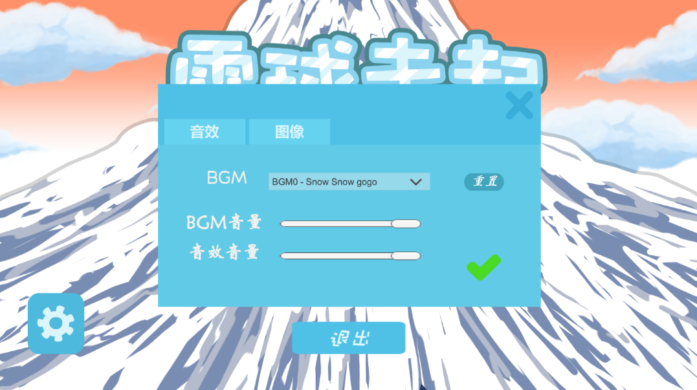

# 前言
目前还未发布，这里简单介绍相关功能。

# 介绍
一款由我学习 Unity 过程中开发的一款2D休闲手游。其中游戏框架的设计，部分界面的绘制，动画，逻辑实现等都由个人完成。

## 游戏特点
+ 操作简单易上手
+ 支持中英语言切换
+ 其中引入了简单的商店系统
+ 配置界面可配置BGM，音量大小，以及一些特效（还不够完善）
+ 有一个比较完整的关卡流程
+ 有较为简易的结算系统和界面
+ 有教程关卡

# 截图

(主界面)

(设置界面)

(关卡界面)

(商店)

(游戏场景)

(结算面板)

# Feature
项目较早，有些设计思想放到现在有些愚蠢了，等安顿下来，会将整个项目重构，包括框架，UI等。
